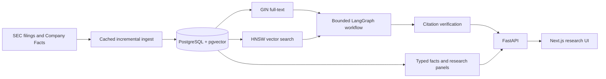
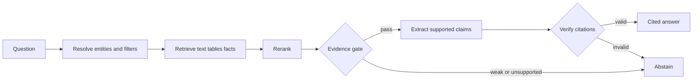

# Financial Document Retrieval Engine

FDRE converts SEC filings into auditable retrieval results, structured financial facts,
point-in-time research features, and reproducible event-study inputs.

[Live service](https://thefdre.com) ·
[API](https://api.thefdre.com/health) ·
[Architecture](docs/architecture.md) ·
[Roadmap](docs/codex_plan.md) ·
[Benchmark](docs/eval_plan.md)

FDRE is research infrastructure for Research/Data Engineering and Quant Research Engineering. It
is not a trading strategy, portfolio optimizer, execution simulator, or low-latency system.

## Production Corpus

Measured from production on June 30, 2026:

| Metric | Value |
| --- | ---: |
| S&P 500 primary tickers indexed | 499 / 500 |
| SEC filings (10-K / 10-Q) | 2,749 |
| Parsed chunks | 2,694,321 |
| Embedded chunks | 2,571,371 |
| Embeddings | Voyage `voyage-4-large`, 512-dim, stored as `halfvec` |

The corpus spans roughly five years of 10-K/10-Q history per issuer (2021–2026, via
chained `sp500-ingest` runs), enabling multi-year point-in-time retrieval and event
studies. The constituent list is current and therefore survivorship-biased. Vectors are
stored at half precision (`halfvec`) — the HNSW index already ranks on the half-precision
cast, so this halves vector storage with no change to retrieval results.

## What It Does

- Hybrid PostgreSQL full-text and pgvector retrieval with exact company resolution,
  multi-query expansion, and neighbor-chunk context (all behind a labeled benchmark).
- Citation-verified answers with deliberate abstention for unsupported requests.
- Point-in-time-aware answer caching: identical questions serve a stored response
  (`X-Cache: HIT`) instead of re-running retrieval; abstentions are never cached.
- SEC acceptance-time filtering, amendments, comparable filings, and filing differences.
- Typed Company Facts queries for a restrained canonical metric set.
- Point-in-time issuer-period panels in JSON, CSV, or Parquet.
- Provider-neutral filing event studies with leakage checks and persisted experiment manifests.
- Point-in-time disclosure-change signal studies — a "Lazy Prices" disclosure-similarity
  replication, a risk-expansion-to-volatility study, and a sector-neutral composite of the
  three — with quantile portfolios, information coefficients, and bootstrap inference
  (`GET /research/signal-studies`). The honest finding: the signals are genuinely
  uncorrelated but individually weak, so naive combination is no free lunch.
- Incremental ingestion, provider backoff, run manifests, and corpus quality audits.

## Architecture



PostgreSQL owns metadata, lexical and vector retrieval, facts, traces, ingestion manifests, and
research experiments. This avoids separate search, vector, queue, and analytics services.

The answer workflow is fixed and inspectable:



## Local Development

Requirements: Python 3.11+, Node.js 22+, Docker.

```bash
python3 -m venv .venv
source .venv/bin/activate
python3 -m pip install -e ".[dev,data]"
cp .env.example .env
docker compose up -d postgres
alembic upgrade head
python3 -m scripts.retrieval_pipeline seed-demo
uvicorn apps.api.app.main:app --reload
```

In another terminal:

```bash
cd apps/web
cp .env.example .env.local
npm ci
npm run dev
```

Set a descriptive `SEC_USER_AGENT` before live SEC requests. Paid providers are optional for tests
and the sample demo. `.env.example` and `apps/web/.env.example` are the configuration references.

## Pipeline

The main CLI owns retrieval artifacts and research outputs:

```bash
python3 -m scripts.retrieval_pipeline --help
python3 -m scripts.retrieval_pipeline index --tickers AAPL MSFT
python3 -m scripts.retrieval_pipeline xbrl --tickers AAPL MSFT
python3 -m scripts.retrieval_pipeline panel --tickers AAPL MSFT \
  --as-of 2026-06-01T00:00:00+00:00 --format parquet \
  --output data/processed/research-panel.parquet
python3 -m scripts.retrieval_pipeline audit
```

Batch ingestion remains a separate operational command because GitHub Actions uses its resumable
stage manifests:

```bash
python3 scripts/ingest_ticker_batch.py \
  --universe research50 --limit 50 --annual-limit 3 --quarterly-limit 8
```

## API

Core endpoints:

- `GET /health`, `/coverage`, `/companies`
- `POST /search`, `/answer` (point-in-time-aware cache; responses carry `X-Cache: HIT|MISS`)
- `GET /research/facts`
- `GET /research/filing-differences/{accession_number}`
- `POST /research/thematic-scan`
- `GET /research/panel`, `/research/panel/export`
- `GET /research/signal-studies`
- `GET /operations/quality`

## Verification

```bash
pytest
ruff check .
mypy .
docker compose config

cd apps/web
npm run lint
npm run typecheck
npm run build
npm run test:e2e
```

CI also runs PostgreSQL pgvector migration and query-plan tests. Railway runs Alembic as a
pre-deploy command before starting uvicorn; Vercel serves the frontend.

## Retrieval evaluation

A labeled, content-grounded benchmark drives the fusion defaults rather than assumption —
`data/evals/retrieval_benchmark.jsonl` (33 semantic / paraphrased queries; a hit counts only if it
shares the issuer + section and contains the labeled quote). The ablation is honest about what
actually helps on this corpus:

| Variant | recall@5 | MRR | nDCG@5 |
| --- | ---: | ---: | ---: |
| Baseline (single query, weighted fusion) | 0.152 | 0.086 | 0.102 |
| **Multi-query expansion (shipped default)** | **0.212** | **0.125** | **0.146** |

RRF and BM25-over-pool underperformed on this corpus, so both are opt-in; multi-query expansion
(+40% recall) is the shipped default, and neighbor-chunk expansion lifts context recall
0.212 → 0.242. Reproduce with `python3 -m scripts.benchmark_retrieval`. A larger reviewed holdout
set and post-index production-latency distributions are still pending.

## Data Policy

Do not commit filings, HTTP caches, embeddings, market data, generated panels, database dumps,
`.env` files, or secrets. Tiny deterministic fixtures belong in `data/sample/`.
