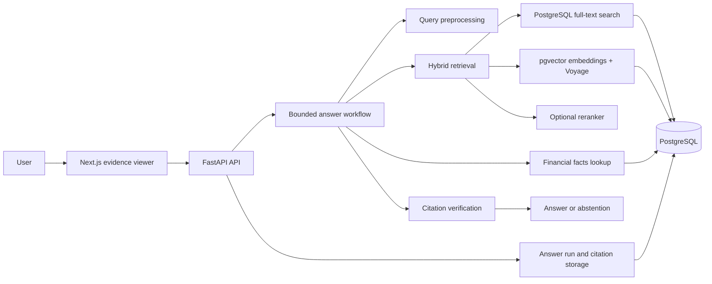
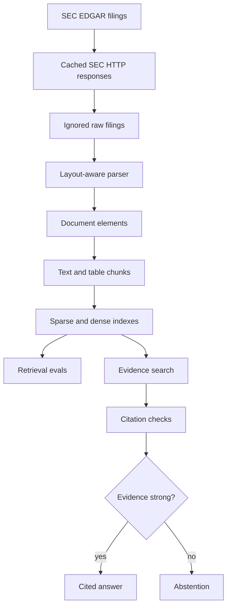
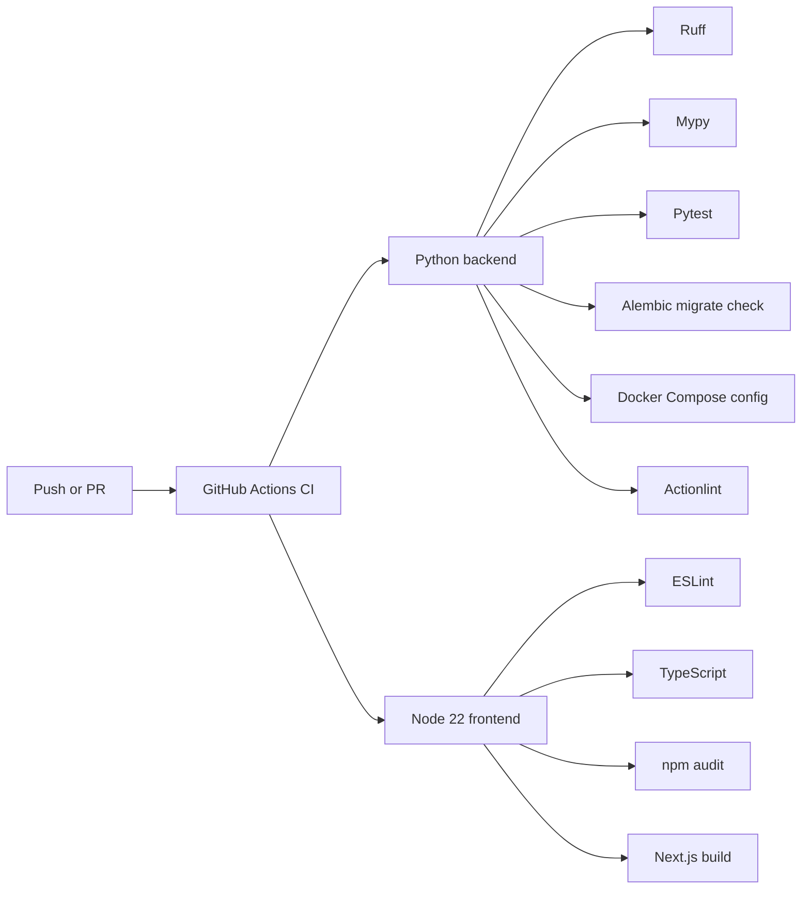
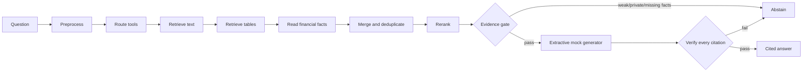
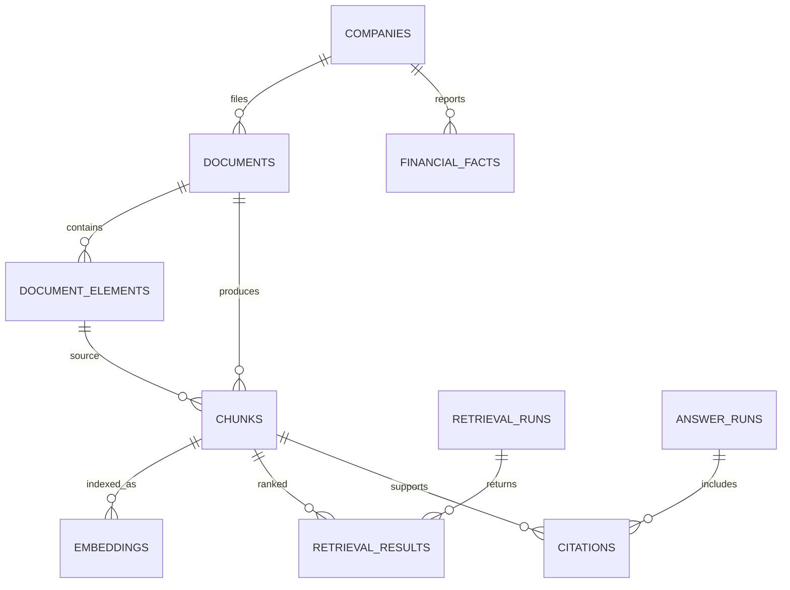

# Financial Document Retrieval Engine

FDRE is a **financial RAG system**: it batch-indexes SEC filings into a hybrid vector + keyword store, then runs a **bounded retrieval agent at query time** to fetch evidence, verify citations, and abstain when support is weak.

Live demo: [thefdre.com](https://thefdre.com)

Repository: [kenchengkc/the-financial-document-retrieval-engine](https://github.com/kenchengkc/the-financial-document-retrieval-engine)

FDRE is not a generic "chat with PDFs" wrapper or a legacy document keyword box. It is a production-style retrieval stack for funds and research teams: layout-aware parsing, **pgvector embeddings**, PostgreSQL full-text search, reranking, **LangGraph agent routing**, citation verification, evals, and abstention.

## How RAG Works Here

FDRE separates **offline indexing** from **online retrieval**:

| Phase | When | What happens |
|-------|------|--------------|
| **Ingest** | Batch / scheduled | Download SEC filings, parse structure, chunk text and tables |
| **Index** | Batch / incremental | Embed chunks into **pgvector**; build sparse FTS indexes in PostgreSQL |
| **Retrieve** | **Live on every query** | Hybrid dense + sparse search, rerank, metadata filters |
| **Answer** | **Live on every query** | Bounded LangGraph agent verifies citations, then answers or abstains |

You do **not** need filings indexed for every name in the company catalog. `listed_companies.json` is an ingestion allowlist (one CIK per NASDAQ/NYSE company, ETFs excluded). **RAG only runs on documents you have parsed and embedded** — today that is the ingested sample universe (e.g. AAPL, MSFT, NVDA, AMZN, GOOGL), expandable ticker by ticker.

Compared with traditional search (Ctrl+F, basic EDGAR keyword search, or static screeners):

- **Semantic retrieval** over section-aware chunks and tables, not just literal string match
- **Hybrid ranking** combines vector similarity and lexical recall
- **Agent workflow** routes to text, tables, and facts tools before any generation
- **Grounded output** with verified citations and explicit abstention when evidence is thin

The core signal should come from retrieval quality, financial metadata design, table handling, citation verification, abstention, and traceability — not from expensive generation APIs.

See [`docs/architecture.md`](docs/architecture.md) for phase-by-phase implementation notes.

## Architecture

FDRE is designed to be cheap to run while still looking serious technically. The MVP uses **PostgreSQL as the vector database** (`pgvector` for embeddings, native FTS for sparse retrieval), optional Voyage embeddings, cached SEC data, and explicit evals before adding extra infrastructure.

### System (RAG + agent at query time)



### Ingestion and retrieval pipeline



### CI



## Current Status

Phases 0 through 13 are implemented and tested:

- SEC ingestion, cached downloads, SHA-256 deduplication, and layout-aware HTML parsing
- Section-aware text chunks and preserved table markdown/summary chunks
- Deterministic local embeddings with an optional OpenAI embedding provider
- PostgreSQL full-text search with a SQLite test fallback
- Deterministic ticker, filing, section, table, and financial-fact routing
- Hybrid dense/sparse retrieval, metadata filters, and pluggable reranking
- Retrieval evaluation for Recall@k, Precision@k, MRR, nDCG, section hits, and table recall
- Citation verification, answer abstention, and a bounded typed LangGraph workflow
- `GET /health`, `POST /search`, and `POST /answer`
- Persistent retrieval runs, answer runs, and verified citations
- A typed Next.js evidence viewer with score and graph trace inspection

Later-phase status:

- Phase 14 is partial: the schema and read-only graph route exist, but XBRL ingestion and the
  bounded SQL facts tool remain.
- Phase 15 is complete: the evidence viewer is deployed at [thefdre.com](https://thefdre.com).
- Phase 16 is partial: answer traces are returned and stored, but trace/eval read endpoints and
  broader production observability remain.
- Phase 17 remains optional roadmap work for complex PDF parsing.
- Phase 18 is mostly complete: the live evidence viewer links here for architecture details;
  trace/eval read API routes remain backlog.

## How the Agent Works

The retrieval **agent** is a fixed **LangGraph** state machine — not an open-ended autonomous loop. Each query triggers live hybrid RAG retrieval, then citation checks:



The default generator is deterministic and free. It extracts claims from retrieved evidence; it
does not call a paid LLM. Retrieval uses local hash embeddings and PostgreSQL full-text search.
`MIN_EVIDENCE_CHUNKS` and `MIN_RETRIEVAL_SCORE` control the evidence gate. Every transition is
returned to the web client, and the answer run and citations are persisted.

## Data Model



See [`docs/data_model.md`](docs/data_model.md) for field and index details.

## Local Setup

Create a virtual environment and install the project:

```bash
python -m venv .venv
source .venv/bin/activate
python -m pip install --upgrade pip
python -m pip install -e ".[dev]"
```

Create a local environment file:

```bash
cp .env.example .env
```

Update `SEC_USER_AGENT` in `.env` with your own contact value before making live SEC requests.

For a deterministic no-network demo, load the checked-in sample filing:

```bash
python -m scripts.retrieval_pipeline seed-demo
```

Ingest the latest two 10-K and 10-Q filing records per company:

```bash
python -m scripts.ingest_sec_sample
```

`data/sample/listed_companies.json` lists **5,794** NASDAQ/NYSE operating companies (one CIK each, ETFs excluded, dual-class tickers such as `GOOG`/`GOOGL` aliased to the same company). Regenerate it with:

```bash
python -m scripts.build_listed_company_seeds
```

Pass any supported ticker to `--tickers`; CI and local defaults still use the five megacap sample tickers.

Download those filings and replace their parsed document elements:

```bash
python -m scripts.download_filings --download --parse
```

Narrow either command with `--tickers`, `--forms`, and `--limit`. SEC responses are cached under `data/cache/sec`; raw filing HTML is stored under `data/raw/sec`.

Run the API:

```bash
uvicorn apps.api.app.main:app --reload
```

Check health:

```bash
curl http://127.0.0.1:8000/health
```

Expected response:

```json
{"status":"ok"}
```

Indexed coverage (companies with embedded chunks searchable via RAG):

```bash
curl http://127.0.0.1:8000/coverage
```

The web app top bar shows `indexed / catalog` counts and S&P 500 progress from this endpoint.

Regenerate the S&P 500 batch list (Wikipedia constituents mapped to catalog primary tickers):

```bash
python scripts/build_sp500_tickers.py
```

Run one S&P 500 ingest batch locally (metadata → download/parse → chunk → embed):

```bash
python scripts/ingest_ticker_batch.py --universe sp500 --offset 0 --limit 10
```

GitHub Actions: **Scheduled SEC ingestion** keeps megacap tickers fresh; **S&P 500 batch ingestion** walks `data/sample/sp500_tickers.json` in batches via `workflow_dispatch` (`offset` + `limit`, default `10`).

Production Postgres on **Neon Launch** (pgvector, pay-as-you-go storage) is recommended for S&P 500 indexing. See [docs/neon-migration.md](docs/neon-migration.md) for pooled vs direct connection strings and secret setup.

## Docker

Start PostgreSQL and the API:

```bash
docker compose up --build
docker compose exec api python -m scripts.retrieval_pipeline seed-demo
```

The API listens on `http://127.0.0.1:8000`.
Container startup applies Alembic migrations automatically.

The Compose PostgreSQL service is exposed on host port `15432` by default to avoid colliding with a local Postgres instance on `5432`.

## Frontend

```bash
cd apps/web
cp .env.example .env.local
npm ci
npm run dev
```

`NEXT_PUBLIC_API_URL` selects the FastAPI deployment. The local default is
`http://127.0.0.1:8000`.

The production frontend uses `https://api.thefdre.com`. The API runs on Railway; production
Postgres should use **Neon Launch** (pooled `DATABASE_URL` on the API, direct
`DATABASE_URL_DIRECT` for ingest workflows). Indexed filings, retrieval runs, answer runs, and
citations persist across deployments. Vercel serves the Next.js frontend at
[thefdre.com](https://thefdre.com).

GitHub ingest workflows require `DATABASE_URL`, `SEC_USER_AGENT`, and optional
`DATABASE_URL_DIRECT` (see [docs/neon-migration.md](docs/neon-migration.md)). External
embedding providers also require their API-key secret. Without the required values, workflows
report a successful skip rather than attempting ingestion against an unconfigured database.

## Quality Checks

```bash
pytest
ruff check .
mypy .
cd apps/web
npm run lint
npm run typecheck
npm run build
```

GitHub Actions runs backend, migration, Docker Compose, frontend lint, TypeScript, and
production build checks.

## Database Migrations

Apply migrations locally:

```bash
alembic upgrade head
```

Check the current revision and schema drift:

```bash
alembic current
alembic check
```

Run the migration through Docker:

```bash
docker compose exec api alembic upgrade head
```

## Data Policy

Do not commit raw SEC filings, downloaded PDFs, caches, embeddings, vector indexes, generated artifacts, database dumps, `.env` files, or secrets.

Use:

- `data/sample/` for tiny committed fixtures
- `data/raw/` for downloaded filings
- `data/cache/` for HTTP cache
- `data/processed/` for generated parsed/chunked/indexed artifacts

## API Keys

No API key is required for the local MVP or demo. A descriptive `SEC_USER_AGENT` is required only
when downloading live SEC data. Native pgvector storage is used in PostgreSQL, while local hash
embeddings remain the default.

For Voyage embeddings:

```dotenv
EMBEDDING_PROVIDER=voyage
EMBEDDING_MODEL=voyage-4-large
EMBEDDING_DIMENSIONS=512
EMBEDDING_BATCH_SIZE=128
EMBEDDING_REQUESTS_PER_MINUTE=2000
EMBEDDING_TOKENS_PER_MINUTE=3000000
EMBEDDING_CONCURRENCY=8
VOYAGE_API_KEY=...
```

For Voyage reranking:

```dotenv
RERANKER_PROVIDER=voyage
RERANKER_MODEL=rerank-2.5
VOYAGE_API_KEY=...
```

`VOYAGE_API_KEY` or `OPENAI_API_KEY` is required only when its provider is selected. Indexing is
incremental and commits in batches, so unchanged chunks are not sent to an external API again.
Use `python -m scripts.retrieval_pipeline chunk --force-rechunk` after parser fixes, and scope
embedding backfills with `index --tickers AAPL MSFT`. Scheduled ingestion skips when
`DATABASE_URL`, `SEC_USER_AGENT`, or the selected embedding provider credentials are missing.
