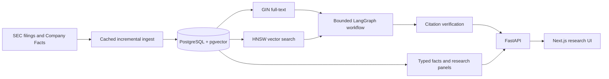
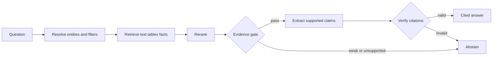

# Financial Document Retrieval Engine

FDRE converts SEC filings into auditable retrieval results, structured financial facts,
point-in-time research features, and reproducible event-study inputs.

[Live service](https://thefdre.com) ·
[API](https://api.thefdre.com/health) ·
[Architecture](docs/architecture.md) ·
[Roadmap](docs/codex_plan.md) ·
[Benchmark](docs/eval_plan.md)

FDRE is research infrastructure for Research/Data Engineering and Quant Research Engineering. It
is not a trading strategy, portfolio optimizer, execution simulator, or low-latency system.

## Production Corpus

Measured from production on June 20, 2026:

| Metric | Value |
| --- | ---: |
| S&P 500 primary tickers indexed | 498 / 499 |
| SEC filings | 1,542 |
| Parsed chunks | 1,536,043 |
| Embedded chunks | 1,535,651 |
| Embeddings | Voyage `voyage-4-large`, 512 dimensions |

The corpus is deepened to several years of 10-K/10-Q history per issuer (chained
`sp500-ingest` runs), enabling multi-year point-in-time retrieval and event studies.
The constituent list is current and therefore survivorship-biased.

## What It Does

- Hybrid PostgreSQL full-text and pgvector retrieval with exact company resolution.
- Citation-verified answers with deliberate abstention for unsupported requests.
- SEC acceptance-time filtering, amendments, comparable filings, and filing differences.
- Typed Company Facts queries for a restrained canonical metric set.
- Point-in-time issuer-period panels in JSON, CSV, or Parquet.
- Provider-neutral filing event studies with leakage checks and persisted experiment manifests.
- Point-in-time disclosure-change signal studies (a "Lazy Prices" replication and a
  risk-expansion-to-volatility study) with quantile portfolios, information coefficients,
  and bootstrap inference — published at `GET /research/signal-studies`.
- Incremental ingestion, provider backoff, run manifests, and corpus quality audits.

## Architecture



PostgreSQL owns metadata, lexical and vector retrieval, facts, traces, ingestion manifests, and
research experiments. This avoids separate search, vector, queue, and analytics services.

The answer workflow is fixed and inspectable:



## Local Development

Requirements: Python 3.11+, Node.js 22+, Docker.

```bash
python3 -m venv .venv
source .venv/bin/activate
python3 -m pip install -e ".[dev,data]"
cp .env.example .env
docker compose up -d postgres
alembic upgrade head
python3 -m scripts.retrieval_pipeline seed-demo
uvicorn apps.api.app.main:app --reload
```

In another terminal:

```bash
cd apps/web
cp .env.example .env.local
npm ci
npm run dev
```

Set a descriptive `SEC_USER_AGENT` before live SEC requests. Paid providers are optional for tests
and the sample demo. `.env.example` and `apps/web/.env.example` are the configuration references.

## Pipeline

The main CLI owns retrieval artifacts and research outputs:

```bash
python3 -m scripts.retrieval_pipeline --help
python3 -m scripts.retrieval_pipeline index --tickers AAPL MSFT
python3 -m scripts.retrieval_pipeline xbrl --tickers AAPL MSFT
python3 -m scripts.retrieval_pipeline panel --tickers AAPL MSFT \
  --as-of 2026-06-01T00:00:00+00:00 --format parquet \
  --output data/processed/research-panel.parquet
python3 -m scripts.retrieval_pipeline audit
```

Batch ingestion remains a separate operational command because GitHub Actions uses its resumable
stage manifests:

```bash
python3 scripts/ingest_ticker_batch.py \
  --universe research50 --limit 50 --annual-limit 3 --quarterly-limit 8
```

## API

Core endpoints:

- `GET /health`, `/coverage`, `/companies`
- `POST /search`, `/answer`
- `GET /research/facts`
- `GET /research/filing-differences/{accession_number}`
- `POST /research/thematic-scan`
- `GET /research/panel`, `/research/panel/export`
- `GET /operations/quality`

## Verification

```bash
pytest
ruff check .
mypy .
docker compose config

cd apps/web
npm run lint
npm run typecheck
npm run build
npm run test:e2e
```

CI also runs PostgreSQL pgvector migration and query-plan tests. Railway runs Alembic as a
pre-deploy command before starting uvicorn; Vercel serves the frontend.

No holdout benchmark score or post-index production latency is published yet. Those numbers remain
gated on the reviewed 120-question dataset and measured latency and ANN-recall distributions.

## Data Policy

Do not commit filings, HTTP caches, embeddings, market data, generated panels, database dumps,
`.env` files, or secrets. Tiny deterministic fixtures belong in `data/sample/`.
