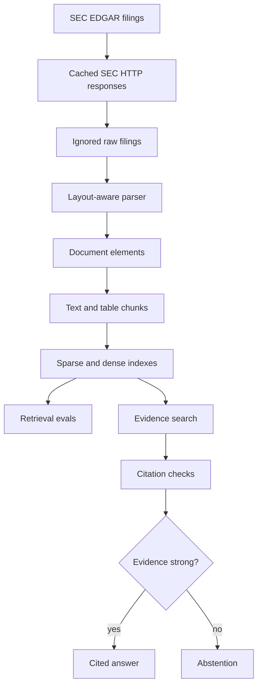
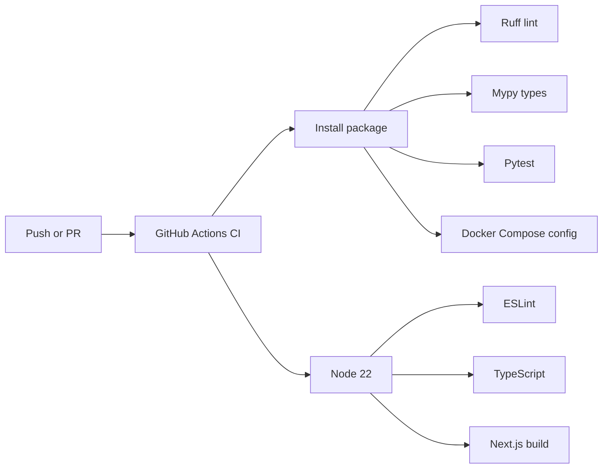
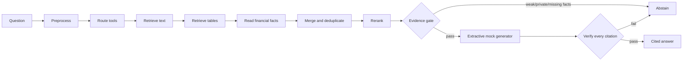
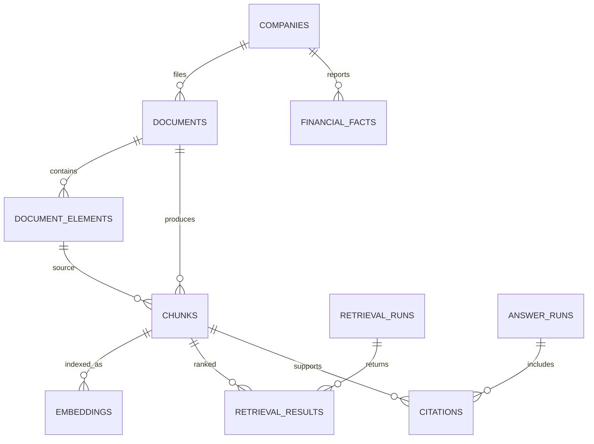

# Financial Document Retrieval Engine

FDRE is a layout-aware search, evidence retrieval, and citation verification system for financial documents.

Website: [thefdre.com](https://thefdre.com)

Repository: `the-financial-document-retrieval-engine`

FDRE is not a generic "chat with PDFs" wrapper. The project is being built as a production-style financial data and retrieval system that ingests SEC filings, parses document structure, indexes text and tables, evaluates retrieval quality, verifies citations, and abstains when evidence is insufficient.

## Architecture Bias

FDRE is designed to be cheap to run while still looking serious technically. The MVP favors PostgreSQL, PostgreSQL full-text search, deterministic local embeddings, mocked generation, cached SEC data, and explicit evaluation before adding paid model providers or extra infrastructure.

The core signal should come from retrieval quality, financial metadata design, table handling, citation verification, abstention, and traceability, not from expensive APIs.

## System Diagram

```mermaid
flowchart LR
  user[User] --> web[Next.js evidence viewer]
  web --> api[FastAPI API]
  api --> graph[Bounded answer workflow]
  graph --> preprocess[Query preprocessing]
  graph --> retrieval[Hybrid retrieval]
  graph --> facts[Read-only financial facts route]
  retrieval --> sparse[PostgreSQL full-text search]
  retrieval --> dense[Local/hash embeddings or optional pgvector]
  retrieval --> rerank[Optional reranker]
  graph --> verify[Citation verification]
  verify --> answer[Answer or abstention]
  api --> traces[Answer run and citation storage]
  sparse --> pg[(PostgreSQL)]
  dense --> pg
  facts --> pg
  traces --> pg
```

## Pipeline Diagram



## CI Diagram



## Current Status

Phases 0 through 13 are implemented and tested:

- SEC ingestion, cached downloads, SHA-256 deduplication, and layout-aware HTML parsing
- Section-aware text chunks and preserved table markdown/summary chunks
- Deterministic local embeddings with an optional OpenAI embedding provider
- PostgreSQL full-text search with a SQLite test fallback
- Deterministic ticker, filing, section, table, and financial-fact routing
- Hybrid dense/sparse retrieval, metadata filters, and pluggable reranking
- Retrieval evaluation for Recall@k, Precision@k, MRR, nDCG, section hits, and table recall
- Citation verification, answer abstention, and a bounded typed LangGraph workflow
- `GET /health`, `POST /search`, and `POST /answer`
- Persistent retrieval runs, answer runs, and verified citations
- A typed Next.js evidence viewer with score and graph trace inspection

Later-phase status:

- Phase 14 is partial: the schema and read-only graph route exist, but XBRL ingestion and the
  bounded SQL facts tool remain.
- Phase 15 is complete: the evidence viewer is deployed at [thefdre.com](https://thefdre.com).
- Phase 16 is partial: answer traces are returned and stored, but trace/eval read endpoints and
  broader production observability remain.
- Phase 17 remains optional roadmap work for complex PDF parsing.
- Phase 18 website and README polish are complete.

## How the Agent Works

The current agent is a fixed LangGraph state machine, not an open-ended autonomous loop:



The default generator is deterministic and free. It extracts claims from retrieved evidence; it
does not call a paid LLM. Retrieval uses local hash embeddings and PostgreSQL full-text search.
`MIN_EVIDENCE_CHUNKS` and `MIN_RETRIEVAL_SCORE` control the evidence gate. Every transition is
returned to the web client, and the answer run and citations are persisted.

## Data Model



See [`docs/data_model.md`](docs/data_model.md) for field and index details.

## Local Setup

Create a virtual environment and install the project:

```bash
python -m venv .venv
source .venv/bin/activate
python -m pip install --upgrade pip
python -m pip install -e ".[dev]"
```

Create a local environment file:

```bash
cp .env.example .env
```

Update `SEC_USER_AGENT` in `.env` with your own contact value before making live SEC requests.

For a deterministic no-network demo, load the checked-in sample filing:

```bash
python -m scripts.retrieval_pipeline seed-demo
```

Ingest the latest two 10-K and 10-Q filing records per sample company:

```bash
python -m scripts.ingest_sec_sample
```

Download those filings and replace their parsed document elements:

```bash
python -m scripts.download_filings --download --parse
```

Narrow either command with `--tickers`, `--forms`, and `--limit`. SEC responses are cached under `data/cache/sec`; raw filing HTML is stored under `data/raw/sec`.

Run the API:

```bash
uvicorn apps.api.app.main:app --reload
```

Check health:

```bash
curl http://127.0.0.1:8000/health
```

Expected response:

```json
{"status":"ok"}
```

## Docker

Start PostgreSQL and the API:

```bash
docker compose up --build
docker compose exec api python scripts/retrieval_pipeline.py seed-demo
```

The API listens on `http://127.0.0.1:8000`.
Container startup applies Alembic migrations automatically.

The Compose PostgreSQL service is exposed on host port `15432` by default to avoid colliding with a local Postgres instance on `5432`.

## Frontend

```bash
cd apps/web
cp .env.example .env.local
npm ci
npm run dev
```

`NEXT_PUBLIC_API_URL` selects the FastAPI deployment. The local default is
`http://127.0.0.1:8000`.

The production frontend uses `https://api.thefdre.com`. The API runs on Railway with managed
PostgreSQL, so indexed filings, retrieval runs, answer runs, and citations persist across
deployments. Vercel serves the Next.js frontend at [thefdre.com](https://thefdre.com).

The scheduled SEC ingestion workflow requires the `DATABASE_URL` and `SEC_USER_AGENT` GitHub
repository secrets. External embedding providers also require their API-key secret. Without the
required values, it reports a successful skip rather than attempting ingestion
against an unconfigured database.

## Quality Checks

```bash
pytest
ruff check .
mypy .
cd apps/web
npm run lint
npm run typecheck
npm run build
```

GitHub Actions runs backend, migration, Docker Compose, frontend lint, TypeScript, and
production build checks.

## Database Migrations

Apply migrations locally:

```bash
alembic upgrade head
```

Check the current revision and schema drift:

```bash
alembic current
alembic check
```

Run the migration through Docker:

```bash
docker compose exec api alembic upgrade head
```

## Data Policy

Do not commit raw SEC filings, downloaded PDFs, caches, embeddings, vector indexes, generated artifacts, database dumps, `.env` files, or secrets.

Use:

- `data/sample/` for tiny committed fixtures
- `data/raw/` for downloaded filings
- `data/cache/` for HTTP cache
- `data/processed/` for generated parsed/chunked/indexed artifacts

## API Keys

No API key is required for the local MVP or demo. A descriptive `SEC_USER_AGENT` is required only
when downloading live SEC data. Native pgvector storage is used in PostgreSQL, while local hash
embeddings remain the default.

For Voyage:

```dotenv
EMBEDDING_PROVIDER=voyage
EMBEDDING_MODEL=voyage-4-large
EMBEDDING_DIMENSIONS=512
VOYAGE_API_KEY=...
```

`VOYAGE_API_KEY` or `OPENAI_API_KEY` is required only when its provider is selected. Indexing is
incremental and commits in batches, so unchanged chunks are not sent to an external API again.
