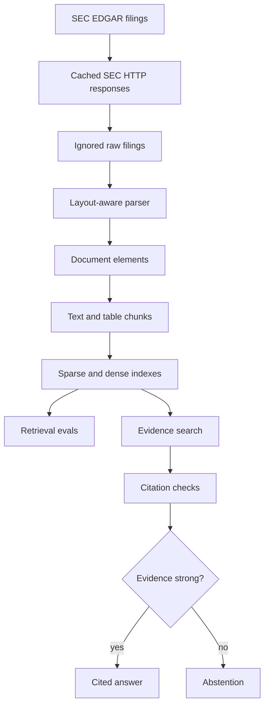
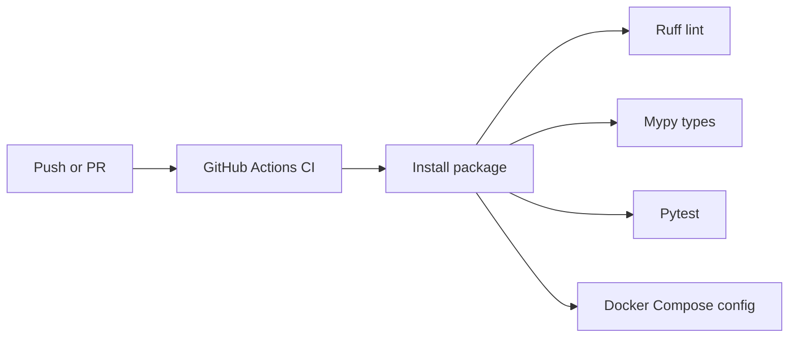

# Financial Document Retrieval Engine

FDRE is a layout-aware search, evidence retrieval, and citation verification system for financial documents.

Website: `thefdre.com`

FDRE is not a generic "chat with PDFs" wrapper. The project is being built as a production-style financial data and retrieval system that ingests SEC filings, parses document structure, indexes text and tables, evaluates retrieval quality, verifies citations, and abstains when evidence is insufficient.

## Architecture Bias

FDRE is designed to be cheap to run while still looking serious technically. The MVP favors PostgreSQL, PostgreSQL full-text search, deterministic local embeddings, mocked generation, cached SEC data, and explicit evaluation before adding paid model providers or extra infrastructure.

The core signal should come from retrieval quality, financial metadata design, table handling, citation verification, abstention, and traceability, not from expensive APIs.

## System Diagram

```mermaid
flowchart LR
  user[User] --> web[Next.js evidence viewer]
  web --> api[FastAPI API]
  api --> graph[Bounded answer workflow]
  graph --> preprocess[Query preprocessing]
  graph --> retrieval[Hybrid retrieval]
  graph --> facts[Safe SQL facts tool]
  retrieval --> sparse[PostgreSQL full-text search]
  retrieval --> dense[Local/hash embeddings or optional pgvector]
  retrieval --> rerank[Optional reranker]
  graph --> verify[Citation verification]
  verify --> answer[Answer or abstention]
  api --> traces[Trace storage]
  sparse --> pg[(PostgreSQL)]
  dense --> pg
  facts --> pg
  traces --> pg
```

## Pipeline Diagram



## CI Diagram



## Current Phase

Phase 0 and Phase 1 are implemented:

- Durable coding-agent guidance in `AGENTS.md`
- Python project configuration in `pyproject.toml`
- FastAPI application factory
- `GET /health` endpoint
- Docker Compose stack with API and PostgreSQL
- Local environment example
- Basic pytest coverage
- Ruff and mypy configuration
- Data directories with ignored raw/cache/processed outputs

Later phases will add schema migrations, SEC ingestion, parsing, chunking, indexing, retrieval, answer generation, LangGraph orchestration, structured financial facts, observability, and the evidence viewer frontend.

## Local Setup

Create a virtual environment and install the project:

```bash
python -m venv .venv
source .venv/bin/activate
python -m pip install --upgrade pip
python -m pip install -e .
```

Create a local environment file:

```bash
cp .env.example .env
```

Update `SEC_USER_AGENT` in `.env` with your own contact value before making live SEC requests in later phases.

Run the API:

```bash
uvicorn apps.api.app.main:app --reload
```

Check health:

```bash
curl http://127.0.0.1:8000/health
```

Expected response:

```json
{"status":"ok"}
```

## Docker

Start PostgreSQL and the API:

```bash
docker compose up --build
```

The API listens on `http://127.0.0.1:8000`.

The Compose PostgreSQL service is exposed on host port `15432` by default to avoid colliding with a local Postgres instance on `5432`.

## Quality Checks

```bash
pytest
ruff check .
mypy .
```

CI runs the same backend checks on GitHub Actions. Frontend checks will be added once the Next.js app is implemented.

## Data Policy

Do not commit raw SEC filings, downloaded PDFs, caches, embeddings, vector indexes, generated artifacts, database dumps, `.env` files, or secrets.

Use:

- `data/sample/` for tiny committed fixtures
- `data/raw/` for downloaded filings
- `data/cache/` for HTTP cache
- `data/processed/` for generated parsed/chunked/indexed artifacts

## Roadmap

The next phase is Phase 2: database schema and Alembic migrations for companies, documents, document elements, chunks, embeddings, financial facts, retrieval runs, answer runs, citations, and eval tables.
