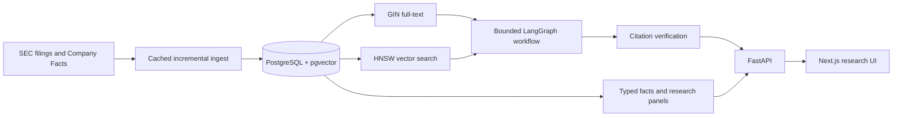
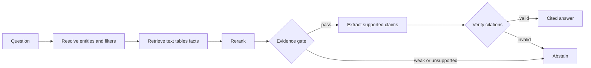

# Financial Document Retrieval Engine

FDRE converts SEC filings into auditable retrieval results, structured financial facts,
point-in-time research features, and reproducible event-study inputs.

[Live service](https://thefdre.com) ·
[API](https://api.thefdre.com/health) ·
[Architecture](docs/architecture.md) ·
[Roadmap](docs/roadmap.md) ·
[Benchmark](docs/eval_plan.md) ·
[Eval results](docs/eval_results.md)

FDRE is research infrastructure for Research/Data Engineering and Quant Research Engineering. It
is not a trading strategy, portfolio optimizer, execution simulator, or low-latency system.

## Highlights

- **2.7M chunks, one database.** 498 S&P 500 issuers × ~5 years of 10-K/10-Q annual and quarterly filings (2,762 filings, 2.71M parsed chunks, 2.71M embeddings) served from a single PostgreSQL for lexical, vector, typed facts, and traces, with no separate search, vector, or queue service.
- **Measured, not assumed.** A labeled 33-query benchmark sets the retrieval defaults: multi-query expansion lifts recall@5 from 0.152 → 0.212 (**+40%**); RRF (Reciprocal Rank Fusion) and BM25 (Best Matching 25 lexical ranking) were implemented, measured, and rejected for underperforming on this corpus.
- **Production research screens: 100% Recall@3/5, zero PIT leakage.** The frozen 28-case cross-sectional development suite run through the live HTTPS API reaches issuer Recall@1/3/5 of **0.929 / 1.000 / 1.000**, evidence Recall@1/3/5 of **0.833 / 0.944 / 0.944**, **100%** condition correctness/lineage/grounding, **0%** point-in-time leakage, and **1.86 s** end-to-end p95 latency.
- **−27% storage, zero quality loss.** Migrating embeddings to `halfvec` (16-bit half-precision vectors) cut the database from **15 GB → 11 GB**, proven safe by byte-identical top-10 ANN (Approximate Nearest Neighbor) results before and after.
- **~44 ms cached answers.** Point-in-time-aware caching returns an identical question from a verified stored result instead of re-running retrieval; abstentions are never cached.
- **Honest research.** Four point-in-time signal studies (disclosure similarity, risk-factor churn, filing-delay surprise, and cash-conversion earnings quality) with real information coefficients, multiple-testing adjustments, and bootstrap inference, reporting genuine null results, not manufactured alpha.

## Production Corpus

Measured from production:

| Metric | Value |
| --- | ---: |
| S&P 500 primary tickers indexed | 498 / 499 |
| SEC filings (10-K annual / 10-Q quarterly) | 2,762 |
| Parsed chunks | 2,712,277 |
| Embedded chunks | 2,712,277 |
| Embeddings | Voyage `voyage-4-large`, 512-dim, stored as `halfvec` |

The corpus spans roughly five years of 10-K/10-Q history per issuer (2021–2026, via
chained `sp500-ingest` runs), enabling multi-year point-in-time retrieval and event
studies. The constituent list is current and therefore survivorship-biased. The one company
without indexed data is FedEx Freight (`FDXF`), a June 2026 spin-off from FedEx whose EDGAR
(Electronic Data Gathering, Analysis, and Retrieval) history is still only registration, `8-K` (material
event), and insider filings, with no 10-K or 10-Q yet, so there is nothing to retrieve until its first
quarterly report. Vectors are stored at half precision (`halfvec`); the HNSW (Hierarchical Navigable
Small World) index already ranks on the half-precision cast, so this halves vector storage with no
change to retrieval results.

## What It Does

- Hybrid PostgreSQL full-text and pgvector retrieval with exact company resolution,
  multi-query expansion, and neighbor-chunk context (all behind a labeled benchmark).
- Citation-verified answers with deliberate abstention for unsupported requests.
- Point-in-time-aware answer caching: identical questions serve a stored response
  (`X-Cache: HIT`) instead of re-running retrieval; abstentions are never cached.
- SEC acceptance-time filtering, amendments, comparable filings, and filing differences.
- Typed Company Facts queries for a restrained canonical metric set.
- Point-in-time issuer-period panels in JSON, CSV, or Parquet.
- Provider-neutral filing event studies with leakage checks and persisted experiment manifests.
- Point-in-time disclosure and fundamental signal studies: a "Lazy Prices" disclosure-similarity
  replication, a risk-factor churn study, an issuer filing-delay surprise study, and a cash-conversion
  earnings quality study, with quantile portfolios, information coefficients, and bootstrap inference
  (`GET /research/signal-studies`). The honest finding: the signals are genuinely
  uncorrelated but individually weak, so naive combination is no free lunch.
- Incremental ingestion, provider backoff, run manifests, and corpus quality audits.

## Architecture


```mermaid
flowchart LR
  sec[SEC filings and Company Facts] --> ingest[Cached incremental ingest]
  ingest --> pg[(PostgreSQL + pgvector)]
  pg --> sparse[GIN full-text]
  pg --> dense[HNSW vector search]
  sparse --> workflow[Bounded LangGraph workflow]
  dense --> workflow
  pg --> facts[Typed facts and research panels]
  workflow --> verify[Citation verification]
  verify --> api[FastAPI]
  facts --> api
  api --> web[Next.js research UI]
```

PostgreSQL owns metadata, lexical and vector retrieval, facts, traces, ingestion manifests, and
research experiments. This avoids separate search, vector, queue, and analytics services.

The answer workflow is fixed and inspectable:


```mermaid
flowchart LR
  q[Question] --> resolve[Resolve entities and filters]
  resolve --> retrieve[Retrieve text tables facts]
  retrieve --> rerank[Rerank]
  rerank --> gate{Evidence gate}
  gate -->|pass| extract[Extract supported claims]
  gate -->|weak or unsupported| abstain[Abstain]
  extract --> cite{Verify citations}
  cite -->|valid| answer[Cited answer]
  cite -->|invalid| abstain
```

## Local Development

Requirements: Python 3.11+, Node.js 22+, Docker.

```bash
python3 -m venv .venv
source .venv/bin/activate
python3 -m pip install -e ".[dev,data]"
cp .env.example .env
docker compose up -d postgres
alembic upgrade head
python3 -m scripts.retrieval_pipeline seed-demo
uvicorn apps.api.app.main:app --reload
```

In another terminal:

```bash
cd apps/web
cp .env.example .env.local
npm ci
npm run dev
```

Set a descriptive `SEC_USER_AGENT` before live SEC requests. Paid providers are optional for tests
and the sample demo. `.env.example` and `apps/web/.env.example` are the configuration references.

## Pipeline

The main CLI owns retrieval artifacts and research outputs:

```bash
python3 -m scripts.retrieval_pipeline --help
python3 -m scripts.retrieval_pipeline index --tickers AAPL MSFT
python3 -m scripts.retrieval_pipeline xbrl --tickers AAPL MSFT
python3 -m scripts.retrieval_pipeline panel --tickers AAPL MSFT \
  --as-of 2026-06-01T00:00:00+00:00 --format parquet \
  --output data/processed/research-panel.parquet
python3 -m scripts.retrieval_pipeline audit
```

Batch ingestion remains a separate operational command because GitHub Actions uses its resumable
stage manifests:

```bash
python3 scripts/ingest_ticker_batch.py \
  --universe research50 --limit 50 --annual-limit 3 --quarterly-limit 8
```

## API

Core endpoints:

- `GET /health`, `/coverage`, `/companies`
- `POST /search`, `/answer` (point-in-time-aware cache; responses carry `X-Cache: HIT|MISS`)
- `GET /research/facts`
- `GET /research/filing-differences/{accession_number}`
- `POST /research/thematic-scan`
- `GET /research/panel`, `/research/panel/export`
- `GET /research/signal-studies`
- `GET /operations/quality`

## Verification

```bash
pytest
ruff check .
mypy .
alembic check
docker compose config

cd apps/web
npm run lint
npm run typecheck
npm run build
npm run test:e2e
```

CI also runs PostgreSQL pgvector migration and query-plan tests. Railway runs Alembic as a
pre-deploy command before starting uvicorn; Vercel serves the frontend.

## Retrieval evaluation

A labeled, content-grounded benchmark drives the fusion defaults rather than assumption:
`data/evals/retrieval_benchmark.jsonl` (33 semantic / paraphrased queries; a hit counts only if it
shares the issuer + section and contains the labeled quote). The ablation is honest about what
actually helps on this corpus:

| Variant | Recall@5 | MRR | nDCG@5 |
| --- | ---: | ---: | ---: |
| Baseline (single query, weighted fusion) | 0.152 | 0.086 | 0.102 |
| **Multi-query expansion (shipped default)** | **0.212** | **0.125** | **0.146** |

- **Recall@5**: Proportion of labeled target evidence chunks retrieved within the top 5 candidates.
- **MRR (Mean Reciprocal Rank)**: The average reciprocal rank ($1/\text{rank}$) of the first relevant chunk found.
- **nDCG@5 (Normalized Discounted Cumulative Gain)**: Graded ranking quality metric penalizing relevant results appearing further down the list.

RRF (Reciprocal Rank Fusion) and BM25-over-pool underperformed on this corpus, so both are opt-in; multi-query expansion
(+40% recall) is the shipped default, and neighbor-chunk expansion lifts context recall
0.212 → 0.242. Reproduce with `python3 -m scripts.benchmark_retrieval`.

A reviewed 120-question (80/40) holdout contract is frozen in
`data/evals/retrieval_benchmark.jsonl`. Latency, ANN, and holdout results are in
[`docs/eval_results.md`](docs/eval_results.md): single-name p95 **1.95 s**,
cross-sectional p95 **1.74 s**, ANN max delta **0.00**, Hybrid holdout Recall@10
**0.375** (aspirational 0.85 needs human paraphrases).

### Production cross-sectional screen evaluation

The frozen 28-case Cross-Sectional v2 development suite is also executed through the deployed
`POST /research/screen` HTTPS route. This measures the real production path—including network,
API, panel construction, optional hybrid semantic retrieval/reranking, evidence restriction, and
lineage validation—rather than only an in-process executor.

| Metric | Production result |
| --- | ---: |
| Successful requests | **28 / 28** |
| Issuer Recall@1 / @3 / @5 | **0.929 / 1.000 / 1.000** |
| Evidence Recall@1 / @3 / @5 | **0.833 / 0.944 / 0.944** |
| Condition correctness | **1.000** |
| Exact condition-lineage replay | **1.000** |
| Strict condition grounding | **1.000** |
| PIT leakage rate | **0.000** |
| Mean / max semantic search calls | **0.643 / 1** |
| API latency p50 / p95 | **1.233 s / 1.757 s** |
| End-to-end HTTPS p50 / p95 | **1.339 s / 1.860 s** |
| HTTPS overhead p50 / p95 | **104 ms / 110 ms** |

Latency by task type:

| Task | n | API p50 | API p95 | HTTPS p50 | HTTPS p95 | Issuer Recall@1 |
| --- | ---: | ---: | ---: | ---: | ---: | ---: |
| Structured | 5 | 356 ms | 660 ms | 458 ms | 764 ms | 1.000 |
| Change | 5 | 340 ms | 972 ms | 445 ms | 1.075 s | 1.000 |
| Temporal | 3 | 1.253 s | 1.397 s | 1.357 s | 1.500 s | 1.000 |
| Semantic | 10 | 1.318 s | 2.048 s | 1.426 s | 2.336 s | 0.800 |
| Semantic + structured | 5 | 1.371 s | 1.801 s | 1.475 s | 1.904 s | 1.000 |

These are production measurements from **August 27, 2026** on the then-current corpus. They are
not a fixed SLO: a separate 18-case semantic stage profile on the same deployed revision measured
HTTPS p95 **3.137 s** and dense-retrieval p95 **1.548 s**, so the current conclusion is that the
route clears the immediate `<3 s` semantic target on the frozen 28-case run while semantic tail
variance remains an active optimization target.

## Key Abbreviations & Glossary

| Abbreviation / Term | Definition & Context |
| :--- | :--- |
| **SEC** | **U.S. Securities and Exchange Commission** — Federal regulator governing securities markets, disclosures, and filing standards. |
| **10-K / 10-Q / 8-K** | **SEC Filing Types** — `10-K`: Comprehensive annual corporate report; `10-Q`: Unaudited quarterly report; `8-K`: Material current event announcement. |
| **EDGAR** | **Electronic Data Gathering, Analysis, and Retrieval** — The SEC's public database where corporate filings are submitted, indexed, and retrieved. |
| **CIK** | **Central Index Key** — A unique 10-digit number assigned by the SEC to identify a specific corporate issuer. |
| **XBRL** | **eXtensible Business Reporting Language** — Machine-readable standard used in SEC Company Facts for structured financial data and tables. |
| **GIN** | **Generalized Inverted Index** — PostgreSQL's inverted indexing method for high-performance lexical full-text search (`tsvector`). |
| **HNSW** | **Hierarchical Navigable Small World** — Graph-based vector index algorithm in `pgvector` for fast approximate nearest neighbor retrieval. |
| **halfvec** | **16-bit Float Vector (`float16`)** — A compact storage format in `pgvector` that cuts vector storage by half with zero loss in ANN ranking fidelity. |
| **ANN** | **Approximate Nearest Neighbor** — Vector similarity search that optimizes query speed and scalability over exact linear scan. |
| **RRF** | **Reciprocal Rank Fusion** — A hybrid ranking algorithm that combines score positions from multiple retrieval algorithms without requiring score normalization. |
| **BM25** | **Best Matching 25** — A probabilistic term-weighting ranking function commonly used for lexical search. |
| **MRR** | **Mean Reciprocal Rank** — Information retrieval metric evaluating how high the first relevant document is ranked ($1/\text{rank}$). |
| **nDCG@k** | **Normalized Discounted Cumulative Gain at rank $k$** — Information retrieval metric measuring ranking quality with position discounts. |
| **PIT** | **Point-in-Time** — Research data filtered strictly by SEC acceptance timestamps (`accepted_at`), eliminating lookahead bias and future information leakage. |
| **IC** | **Information Coefficient** — Spearman rank correlation between quantitative signal forecasts and forward realized performance. |

## Data Policy

Do not commit filings, HTTP caches, embeddings, market data, generated panels, database dumps,
`.env` files, or secrets. Tiny deterministic fixtures belong in `data/sample/`.
