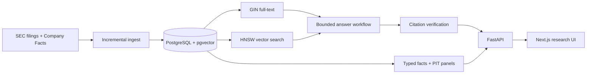

# Financial Document Retrieval Engine

FDRE turns SEC filings into source-linked answers, structured financial data, and point-in-time
research datasets. It is built for research and data engineering workflows where provenance,
availability time, and reproducibility matter.

[Live service](https://thefdre.com) ·
[API health](https://api.thefdre.com/health) ·
[Architecture](docs/architecture/system.md) ·
[Roadmap](docs/roadmap.md) ·
[Evaluation plan](docs/evaluations/eval_plan.md) ·
[Evaluation results](docs/evaluations/eval_results.md) ·
[Holdout policy](docs/evaluations/holdout_policy.md) ·
[Portable experiment bundles](docs/research/experiment-bundles.md)

FDRE is research infrastructure. It is not a trading strategy, portfolio optimizer, execution
simulator, or low-latency trading system.

## Production snapshot

Latest documented production measurements from August 25–27, 2026:

| Metric | Current snapshot |
| --- | ---: |
| Live usage | ~75 monthly active users |
| S&P 500 primary tickers indexed | 499 / 499 |
| 10-K / 10-Q filings indexed | 3,204 |
| Parsed and embedded chunks | 3,039,403 |
| Embeddings | Voyage `voyage-4-large`, 512 dimensions, `halfvec` |
| PostgreSQL database size after `halfvec` migration | ~11 GB |

The indexed filing history spans roughly five years per issuer. The production constituent list is
current, so it is useful for live retrieval but is **not** a historical-membership universe. Research
workflows that require historical membership use separate point-in-time lineage and archived
universe artifacts.

## Capabilities

- Hybrid PostgreSQL full-text + pgvector retrieval with company/date filters, multi-query
  expansion, reranking, and neighbor-chunk context.
- Citation-verified answers that abstain when the retrieved filing evidence is insufficient.
- SEC acceptance-time filtering for point-in-time queries, comparable filings, amendments, and
  filing differences.
- Typed Company Facts access for a restrained canonical metric set.
- Point-in-time issuer-period panels exported as JSON, CSV, or Parquet.
- Cross-sectional screens and provider-neutral filing event studies with lineage and leakage checks.
- Stable-security historical-universe snapshots and diffs that separate membership changes from
  ticker/identity/provenance changes.
- Content-addressed experiment roots with fail-closed replay, typed artifact validation, and
  deterministic portable bundles that can be verified offline without a live database.
- Persisted, content-free retrieval telemetry from bounded latest-N samples for production
  diagnostics without storing query text in the aggregate endpoint.
- Incremental ingestion with provider backoff, resumable manifests, and corpus-quality audits.

Repeated verified questions can be served from a point-in-time-aware answer cache (`X-Cache: HIT`);
abstentions are never cached.

## Architecture


```mermaid
flowchart LR
  sec[SEC filings + Company Facts] --> ingest[Incremental ingest]
  ingest --> pg[(PostgreSQL + pgvector)]
  pg --> sparse[GIN full-text]
  pg --> dense[HNSW vector search]
  sparse --> workflow[Bounded answer workflow]
  dense --> workflow
  pg --> facts[Typed facts + PIT panels]
  workflow --> verify[Citation verification]
  verify --> api[FastAPI]
  facts --> api
  api --> web[Next.js research UI]
```

PostgreSQL is the system of record for filing metadata, lexical/vector retrieval, facts, traces,
ingestion manifests, and research experiments. FDRE intentionally avoids separate search, vector,
queue, and analytics services.

The answer path is fail-closed: resolve the issuer and time scope, retrieve evidence, rerank it,
apply an evidence gate, extract supported claims, verify citations, and otherwise abstain. See
[`docs/architecture/system.md`](docs/architecture/system.md) for the detailed component and data-flow design.

## Point-in-time contract

Research data is filtered by when information was actually available, using SEC acceptance
timestamps (`accepted_at`) rather than only fiscal-period labels. The system preserves source and
availability lineage through panels, screens, event studies, and persisted experiment artifacts.

This distinction matters because a current-index S&P 500 corpus is survivorship-biased. Live search
coverage and historically valid research universes are therefore treated as separate concepts.
Historical snapshots resolve constituents by stable `security_id`, so ticker changes do not become
false additions/removals in point-in-time universe comparisons.

## Evaluation

### Retrieval

The labeled retrieval benchmark uses semantic/paraphrased questions and content-grounded target
evidence. A hit must match the issuer/section and contain the labeled quote.

| Variant | Recall@5 | MRR | nDCG@5 |
| --- | ---: | ---: | ---: |
| Baseline: single query, weighted fusion | 0.152 | 0.086 | 0.102 |
| **Multi-query expansion (default)** | **0.212** | **0.134** | **0.153** |
| Multi-query + neighbor context | **0.242 context recall** | — | — |

Multi-query expansion improves Recall@5 by about 40%. RRF and BM25-over-pool underperformed on this
corpus and remain opt-in rather than defaults.

The reviewed 120-question benchmark contains an 80-question development split and a published
40-question historical holdout split. The historical holdout reports Hybrid Recall@10 of **0.375**.
Exact-versus-HNSW ANN Recall@10 is **1.00** with **0.00** maximum observed delta, validating
approximate retrieval for the current index configuration. The historical holdout remains below the
aspirational 0.85 gate and is an explicit open quality target rather than a hidden success claim.
Because the holdout cases are now public, future untouched claims require a newly sealed,
access-controlled holdout; see the [holdout lifecycle policy](docs/evaluations/holdout_policy.md).

### Production cross-sectional screen

The frozen 28-case development suite runs through the deployed HTTPS screen route, including panel
construction, optional semantic retrieval/reranking, evidence restriction, and lineage validation.

| Metric | Production result |
| --- | ---: |
| Successful requests | 28 / 28 |
| Issuer Recall@1 / @3 / @5 | 0.929 / 1.000 / 1.000 |
| Evidence Recall@1 / @3 / @5 | 0.833 / 0.944 / 0.944 |
| Condition correctness | 1.000 |
| Exact condition-lineage replay | 1.000 |
| Strict condition grounding | 1.000 |
| PIT leakage rate | 0.000 |
| End-to-end HTTPS p95 | 1.860 s |

These are August 27, 2026 measurements, not a permanent SLO. A separate semantic stage profile on
the same deployed revision measured HTTPS p95 of **3.137 s**, so semantic tail latency remains an
active optimization target.

Full methodology, latency breakdowns, holdout definitions, and reproduction commands live in
[`docs/evaluations/eval_results.md`](docs/evaluations/eval_results.md).

## Research status

FDRE includes four point-in-time signal studies covering disclosure similarity, risk-factor churn,
filing-delay surprise, and cash-conversion earnings quality. Their current results are null or weak;
the repository reports those outcomes directly rather than presenting them as alpha.

The flagship risk-churn acceleration workflow adds a precommitted expanding walk-forward design,
purged unrealized development outcomes, multiple-testing-aware selection gates, 5/10/25/50 bp cost
accounting, sector robustness checks, immutable manifests, and reproducible market-data caching.

Registered research roots bind the exact code, dataset, market-data, universe, feature, filing-lineage,
assumption, child-artifact, and terminal-decision identities used for a claim. The Registry UI can
recompute those hashes and replay the persisted terminal decision; a verified root can also be
exported as a deterministic JSON bundle for independent offline verification. See
[`docs/research/experiment-bundles.md`](docs/research/experiment-bundles.md).

Historical-universe identity closure was verified in production on September 5, 2026: all 45
reviewed actions committed, and both the merged HU-5 gate and independent identity-strict audit
report 6,088/6,088 eligible calendar days (2010-01-01 through 2026-09-01), with zero invalid or
blocked days. See the [closure record](docs/research/historical-universe/final-identity-closure.md)
for run/artifact provenance. The original flagship rerun remains preserved as an immutable research
result; the frozen multi-class outcome policy is a separate versioned path for any amended evaluation.

## Local development

Requirements: Python 3.11+, `uv` 0.12.10, Node.js 22+, Docker.

```bash
uv sync --frozen --extra dev --extra data
cp .env.example .env
docker compose up -d postgres
uv run alembic upgrade head
uv run python -m scripts.pipelines.retrieval_pipeline seed-demo
uv run uvicorn apps.api.app.main:app --reload
```

In another terminal:

```bash
cd apps/web
cp .env.example .env.local
npm ci
npm run dev
```

Set a descriptive `SEC_USER_AGENT` before live SEC requests. Paid providers are optional for tests
and the sample demo. `.env.example` and `apps/web/.env.example` are the configuration references.
The committed `uv.lock` is the Python reproducibility boundary used by CI; frontend dependencies are
installed from `apps/web/package-lock.json` with `npm ci`.

## Data and research CLI

```bash
uv run python -m scripts.pipelines.retrieval_pipeline --help
uv run python -m scripts.pipelines.retrieval_pipeline index --tickers AAPL MSFT
uv run python -m scripts.pipelines.retrieval_pipeline xbrl --tickers AAPL MSFT
uv run python -m scripts.pipelines.retrieval_pipeline panel --tickers AAPL MSFT \
  --as-of 2026-06-01T00:00:00+00:00 --format parquet \
  --output data/processed/research-panel.parquet
uv run python -m scripts.pipelines.retrieval_pipeline audit
```

For point-in-time universe inspection and historical-universe operations, use the consolidated
researcher-facing CLI. `snapshot` and `diff` use the canonical database-backed universe API; the
maintenance commands delegate to their existing authoritative parsers and guards:

```bash
uv run python -m scripts.research.universe --help
uv run python -m scripts.research.universe snapshot sp500 \
  --as-of 2026-06-01 --output universe-2026-06-01.json
uv run python -m scripts.research.universe diff sp500 \
  --from 2025-06-01 --to 2026-06-01 --output universe-diff.json
uv run python -m scripts.research.universe audit --help
uv run python -m scripts.research.universe reconcile --help
uv run python -m scripts.research.universe validate --help
uv run python -m scripts.research.universe promote --help
```

Snapshots fail closed on unresolved provisional or overlapping identity evidence unless
`--include-provisional` is explicitly supplied. Diffs key on stable `security_id`, so a ticker rename
is reported as an identity/provenance change rather than a removal plus addition. Snapshot export
also supports Parquet with `--format parquet --output <path>`. The delegated audit, reconcile,
validate, and promote commands retain their existing parsers, output contracts, and mutation guards;
legacy command paths remain available for compatibility.

A registered experiment chain can be exported from a database and verified later without database
or live-data access:

```bash
uv run python -m scripts.research.research_experiment bundle \
  <experiment-id> --output research-bundle.json
uv run python -m scripts.research.research_experiment verify-bundle \
  research-bundle.json --expected-experiment-id <git-pinned-experiment-id>
```

Batch ingestion is separate because automation relies on resumable stage manifests:

```bash
uv run python scripts/ingestion/ingest_ticker_batch.py \
  --universe research50 --limit 50 --annual-limit 3 --quarterly-limit 8
```

Reproduce the retrieval ablation with:

```bash
uv run python -m scripts.benchmarks.benchmark_retrieval
```

## API

Core endpoints:

- `GET /health`, `/coverage`, `/companies`
- `POST /search`, `/answer`
- `GET /research/facts`
- `GET /research/filing-differences/{accession_number}`
- `POST /research/thematic-scan`
- `GET /research/panel`, `/research/panel/export`
- `GET /research/signal-studies`
- `GET /research/universe/{universe_code}` and `/research/universe/{universe_code}/diff`
- `GET /research/experiments`, `/research/experiments/{experiment_id}`,
  `/research/experiments/{experiment_id}/verify`, and `/research/experiments/{experiment_id}/bundle`
- `GET /operations/quality`
- `GET /operations/retrieval-telemetry?sample_limit=1000`

`POST /answer` responses expose point-in-time-aware cache state through `X-Cache: HIT|MISS`.
`/operations/retrieval-telemetry` returns content-free aggregates over separate latest-N persisted
retrieval and answer samples; it is not a fixed-window or all-request SLO feed.

## Verification

```bash
uv run pytest
uv run ruff check .
uv run mypy .
uv run alembic check
docker compose config

cd apps/web
npm run lint
npm run typecheck
npm run build
npm run test:e2e
```

CI installs the committed Python lock with `uv sync --frozen` and also validates PostgreSQL/pgvector
migrations, retrieval indexes, Docker Compose, the production image, and workflow configuration.
Railway runs Alembic before starting the FastAPI service; Vercel serves the frontend.

## Data policy

Do not commit filings, HTTP caches, embeddings, market data, generated panels, database dumps,
`.env` files, or secrets. Tiny deterministic fixtures belong in `data/sample/`.
