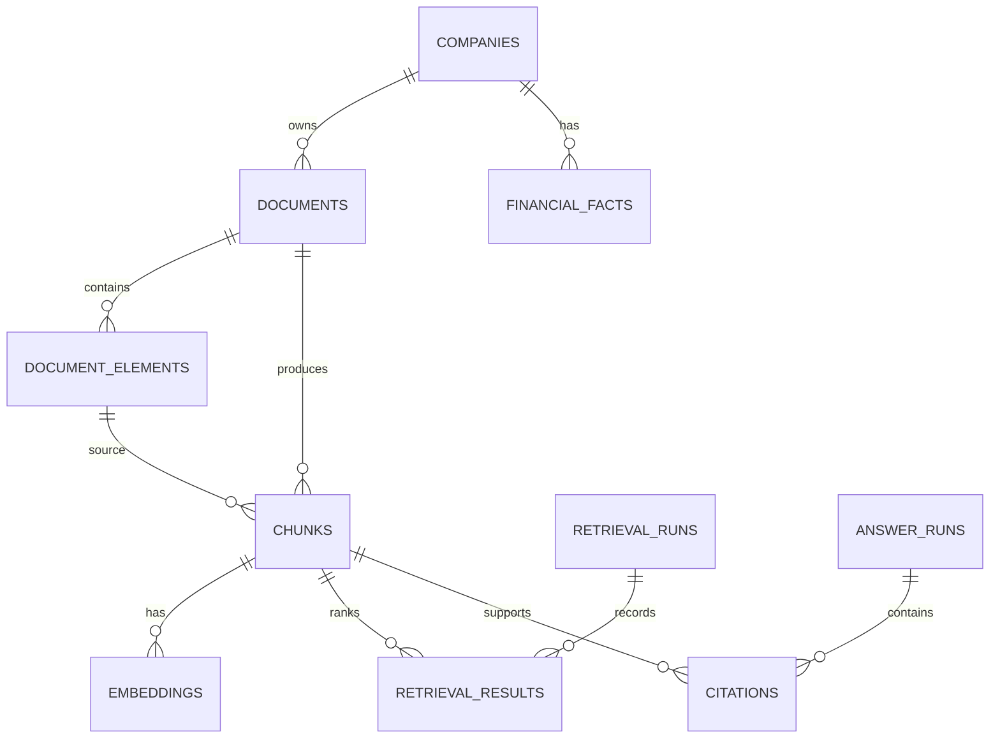

# Data Model

Phase 2 defines the PostgreSQL schema with SQLAlchemy 2.0 models and an Alembic migration baseline.

## Entity Relationships



## Tables

### `companies`

Canonical SEC company identity and classification.

Key fields: `ticker`, `cik`, `name`, `exchange`, `sector`, and `industry`.

`ticker` and `cik` are unique and indexed.

### `documents`

SEC filing metadata and local download state.

Key fields: `company_id`, `source_type`, `form_type`, `filing_date`, `period_end_date`, `accession_number`, source URLs, `local_path`, `sha256_hash`, and `metadata_json`.

### `document_elements`

Layout-aware parser output. Text blocks, tables, titles, figures, and section headers are stored separately.

Key fields: `document_id`, `element_type`, `page_number`, `section`, `text`, `markdown`, `json_payload`, `bbox`, and `reading_order`.

### `chunks`

Retrieval units derived from document elements.

Each chunk belongs to one document and one source element. It stores text, chunk type, section and page boundaries, token count, and retrieval metadata.

### `embeddings`

Provider-independent embedding storage.

The MVP stores vectors in `vector_json` for portability. A later optional pgvector migration can add native vector storage without changing the provider interface.

### `financial_facts`

Normalized SEC XBRL/companyfacts values.

Key fields: company and ticker, normalized concept, numeric value, unit, period, fiscal metadata, form type, accession number, and source metadata.

### `retrieval_runs` and `retrieval_results`

Auditable retrieval execution records.

A run stores the query, structured filters, retriever variant, and latency. Results preserve dense, sparse, hybrid, and rerank scores plus final rank.

### `answer_runs` and `citations`

Answer generation, abstention, and evidence provenance.

An answer run stores rewritten queries, route decision, generated text, confidence, abstention state, latency, and trace state. Every citation belongs to an answer run and a source chunk.

### `eval_questions` and `eval_results`

Retrieval and answer evaluation inputs and metric outputs.

Questions store expected tickers, sections, relevant chunk IDs, answer type, and metadata. Results store metric name, value, eval run identifier, and metadata.

## Indexes

The initial migration includes indexes for:

- company `ticker` and `cik`
- document `company_id`, `form_type`, `filing_date`, and `accession_number`
- element `document_id`, `element_type`, and `section`
- chunk `document_id`, `element_id`, `chunk_type`, and `section`
- financial fact company, ticker, concept, fiscal year, period end, form type, and accession number
- retrieval and citation foreign keys
- eval run identifiers and metric names

## Migrations

Apply the latest schema:

```bash
alembic upgrade head
```

Check the current revision:

```bash
alembic current
```

Check model-to-database drift:

```bash
alembic check
```

Run against Docker PostgreSQL:

```bash
docker compose exec api alembic upgrade head
```

Migration tests use temporary SQLite databases, so the default unit test suite remains offline and does not require Docker.
